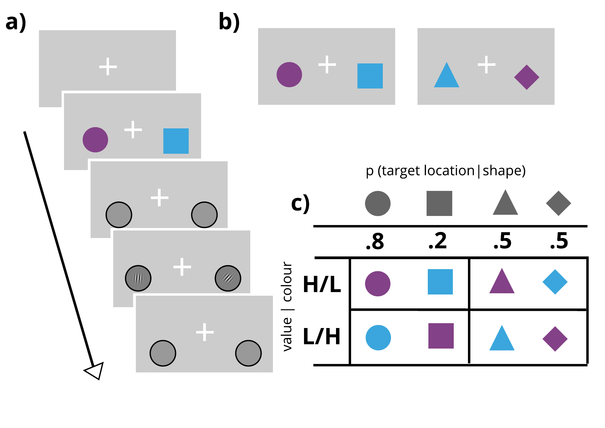

<br><br>

> Initial analysis of the behavioural data collected on a simple paradigm where simple cues (e.g. square, triangle, circle) probabilistically predict the upcoming target location (gabor oriented clockwise or counterclockwise) and the reward value available should the participant got the target correct. [All data was collected using this code](https://github.com/kel-github/imaging-cert-reward-att-task-code/tree/master/pilot).

Note: in the participant figures below, p's 1, 2, 7 & 8 were exposed to the original experimental conditions (code for which is linked to above). Participant 3 was exposed to the experimental conditions with the amendments suggested by Next steps 1 & 2. As you can see, these adjustment did not change performance on the task. 

# Get the data
***
Starting by loading *libraries*. 
```{r, message=FALSE, warning=FALSE}
library(rmarkdown)    # You need this library to run this template.
library(epuRate) 
#library(tidyverse)
library(dplyr)
library(tidyr)
library(cowplot)
library(ggplot2)
library(readr)
#library(rjson)
library(RJSONIO)
source("R_rainclouds.R") # for the raincloud plot
```

Here is the behavioural data in longform. 
Key to data:
sub = subject number, sess = session number, t = trial, rew = cue value, loc = target location, 
cue = shape, co1/co2 = contrast of the target on left and right, or = orientation (0 = anti, 1 = clockwise)
response = correct (1) or incorrect (0), rt = RT, rew_tot = reward value accrued, cert = probability of target location, given the cue

```{r}

get_participant_data <- function(subjects, sessions, data_path) {
  # this function loads each participant's data
  # and concatenates them into a longform dataset
  fn <- 'sub-0%d_ses-%d_task-learn-att-v1-test-v1_events.tsv'
  get_subject_strings <- function(i) {
    get_session_strings <- function(j) dir(sprintf(paste(data_path, "sub-0%d_ses-%d_task-learn-att-v1", sep = "/"), i, j), pattern=sprintf(fn, i, j), full.names = TRUE)
    do.call(cbind, lapply(sessions, get_session_strings))
  }
  files <- do.call(rbind, lapply(subjects, get_subject_strings))
  rownames(files) <- subjects
  colnames(files) <- sessions
  resplog <- function(i, j) read.table(files[as.character(i),as.character(j)], sep = "\t", header = TRUE)
  d <- do.call(rbind, lapply(subjects, function(i) do.call(rbind, lapply(sessions, function (j) resplog(i, j)))))
  
  ### allocate cue certainty (p(left) = .2, .5, .8) by taking cue prob assignment from the relevant subject json file, 
  ### adding a new variable to the subject data frame to denote which trial is which, and then reshaping
  ### the resulting list into a data frame
  
  d$cert <- NA
  # now get cue to cert condition allocation from json file
  fn <- 'sub-0%d_ses-%d_task-learn-att-v1-reward.json' 
  files <- do.call(rbind, lapply(subjects, get_subject_strings))
  rownames(files) <- subjects
  colnames(files) <- sessions
  cuemap <- function(i, j) {
    #js <- fromJSON(files[as.character(i),as.character(j)])
    js <- RJSONIO::fromJSON(files[as.character(i),as.character(j)])
    cue_map = js$cue_order
    cue_map
  }
  js <- do.call(rbind, do.call(rbind, lapply(subjects, function(i) lapply(sessions, function (j) cuemap(i,j)))))
  rownames(js) = subjects
  
  assign.certs <- function(i, d, js){ # map the correct cue to the certainty condition
    data <- d %>% filter(sub == i)
    data$cert[data$cue == js[sprintf("%d", eval(i)), 1] & data$loc == 1] = ".8"
    data$cert[data$cue == js[sprintf("%d", eval(i)), 1] & data$loc == 2] = ".2"
    data$cert[data$cue == js[sprintf("%d", eval(i)), 3] & data$loc == 1] = ".2"
    data$cert[data$cue == js[sprintf("%d", eval(i)), 3] & data$loc == 2] = ".8"    
    data$cert[data$cue == js[sprintf("%d", eval(i)), 2]] = ".5"
    data          
  }
  
  d <- do.call(rbind, lapply(subjects, assign.certs, d = d, js = js))
  d$cert <- as.factor(d$cert)
  
  d$loc <- as.factor(d$loc)
  levels(d$loc) <- c("left", "right")
  d$sub <- as.factor(d$sub)
  d$rew <- as.factor(d$rew)
  levels(d$rew) <- c("0", "50")
  
  d <- d %>% filter(t > 120) # get rid of the first block of trials
  
  d
}

subjects = c(1,2,3,7,8)
sessions = 1
data_path = "~/Dropbox/MC-Projects/imaging-value-cert-att/pilot_data"
raw.data <- get_participant_data(subjects, sessions, data_path)

# Show it:
raw.data %>% head(5)
```


# Overview of individual subject data
***
These [raincloud plots](https://micahallen.org/2018/03/15/introducing-raincloud-plots/) show individual subject RT distributions (rows) for each level of cue certainty (y-axis), for each level of reward value (5 vs 50, orange and purple distributions respectively).  As you can see, there does not appear to be much of a systematic difference between conditions.

## subject level raincloud plots
To get an idea of the spread of data at the individual subject level - each column is one subject (1-4), the left coloumn shows the RT distributions between the 3 location probablity conditions (x-axis) for the low value cue (orange, top row), whereas the right column shows the same probability conditions but for the high value cue (purple, bottom row). The first two subjects show a nice cueing effect for both value conditions, whereas the third and fourth subjects show a slightly different pattern.
```{r, warning=FALSE, fig.align='center'}
get.sub.data <- function(subject, data, sd_reject=3, RT_min=0.1){
  # this function takes the subject index (defined in the variable subject)
  # and all the raw data
  # it filters the data to get the individual subject's data, then trims to
  # get the correct RTs that are > .1 s, and are < 3 * sd from the median
  # for each certainty and reward condition
  sub.data <- data %>% filter(sub == subject)
  sub.data <- sub.data %>% 
                filter(rt > RT_min) %>%
                filter(resp == 1) %>%
                group_by(cert, rew) %>%
                filter(rt < median(rt) + sd_reject*sd(rt)) 
}
# apply the function defined above across subjects, put
# results into a single dataframe
subjects = c("1", "2", "3", "7", "8")  
sub.data <- lapply(subjects, get.sub.data, data = raw.data)
sub.data <- do.call(rbind, sub.data)  

# summarise the median rt data across each subject for the plot below
sum.data <- sub.data %>% group_by(sub, rew, cert) %>%
              summarise(medianRT = median(rt))
  
# now make a raincloud plot for each condition, one plot per participant
lo.col = "#e66101"
hi.col = "#5e3c99"
p <- ggplot(sub.data, aes(x = cert, y = rt, fill = rew, colour = rew)) +
  geom_flat_violin(aes(fill = rew), position = position_nudge(x = .1, y = 0), 
                   adjust = 1.5, trim = FALSE, alpha = .5, colour = NA) +
  geom_point(aes(x = as.numeric(cert), y = rt, colour = rew),
             position = position_jitter(width = .075), size = .1, shape = 20,
             alpha = .5) +
  geom_boxplot(aes(x = cert, y = rt, fill = rew), outlier.shape = NA, 
               alpha = .5, width = .1, colour = "black") +
  geom_line(data = sum.data, aes(x = as.numeric(cert), y=medianRT, group = rew, colour = rew)) +
  scale_fill_manual(values=c(lo.col, hi.col)) +
  scale_color_manual(values=c(lo.col, hi.col)) + facet_wrap(~rew*sub, nrow=2)  +
  ylab("RT") + xlab("location probability") + ylim(c(0.3, 1)) +
  theme(panel.border = element_blank(), panel.grid.major = element_blank(),
        panel.grid.minor = element_blank(), axis.line = element_line(colour = "black"),
        # text=element_text(size=8),
        # axis.text.x = element_text(size=8),
        # axis.text.y = element_text(size=8),
        legend.position = "none") 

p
```


## summary plots
To better visualise the influence of certainty and value, I now show 1) accuracy for each condition, 2) the bias score for median RTs from the p = .2 and .8 conditions (p / .5), and 3) the inverse efficiency score (RT/accuracy, see [Gould et al, 2011](https://www.physiology.org/doi/full/10.1152/jn.00653.2010?url_ver=Z39.88-2003&rfr_id=ori%3Arid%3Acrossref.org&rfr_dat=cr_pub%3Dpubmed&))for each participant.

First, the summary measures are computed (see code chunk for details), and accuracy is plotted for each subject (panels) across the location probability conditions, for the high value (purple) and low value (orange) conditions. As can be seen and as is expected, accuracy generally increases across the probability conditions.
```{r, warning=FALSE, fig.align='center' }

# first I do a bit of data wrangling to summarise the data, and then define plotting functions,
# then I will plot accuracy in this code panel, then the bias score, and then inverse efficiency
sum.bias = sub.data %>% group_by(sub, rew) %>%
  summarise(p.8 = median(rt[cert == ".8"])/median(rt[cert == ".5"]),
            p.2 = median(rt[cert == ".2"])/median(rt[cert == ".5"]))
sum.bias = gather(sum.bias, key="cond", value = bias, p.8:p.2, factor_key=TRUE)

acc.data = raw.data %>% group_by(sub, rew, cert) %>%
            summarise(acc = mean(resp))
sum.inv.eff = sub.data %>% group_by(sub, rew, cert) %>%
            summarise(medRT = median(rt)) %>%
            inner_join(acc.data, sum.inv.eff, by=c("sub", "rew", "cert")) %>%
            transform(inv_eff = medRT/acc)

line.plot <- function(data, dv, ylims){
          ggplot(data, aes_string(x="cert", y=dv, col="rew")) +
            geom_line(aes(group=rew)) + geom_point() +
            facet_wrap(~sub, nrow=2) +  
            scale_fill_manual(values=c(lo.col, hi.col)) +
            scale_color_manual(values=c(lo.col, hi.col)) + 
            ylab(dv) + xlab("location probability") + ylim(ylims) +
            theme(panel.border = element_blank(), 
                  panel.grid.major =   element_blank(),
            panel.grid.minor = element_blank(), 
            axis.line = element_line(colour = "black"),
            # text=element_text(size=8),
            # axis.text.x = element_text(size=8),
            # axis.text.y = element_text(size=8),
            legend.position = "none") 
  
}

bias.plot <- function(data, ylims){
        ggplot(data, aes(x=cond, y=bias, col=rew)) +
            geom_line(aes(group=rew)) + geom_point() + 
            scale_fill_manual(values=c(lo.col, hi.col)) +
            scale_color_manual(values=c(lo.col, hi.col)) + 
            ylab("bias") + xlab("condition") + ylim(ylims) +
            facet_wrap(~sub, nrow=2) +
            theme(panel.border = element_blank(), 
                  panel.grid.major = element_blank(),
            panel.grid.minor = element_blank(), 
            axis.line = element_line(colour = "black"),
            # text=element_text(size=8),
            # axis.text.x = element_text(size=8),
            # axis.text.y = element_text(size=8),
            legend.position = "none") 
}

acc.p <- line.plot(sum.inv.eff, dv="acc", ylims=c(0.5,1))
acc.p
```

Next I plot each participants bias score (med RT p (.2 | .8) / med RT p=.5), according to the same convention described above. As can be seen, participants 1 & 2 show a change in bias that is slightly larger for the high value (purple) relative to the low value (orange) context. However, the pattern for subs 3 & 4 is less clear. Participant 3's data is suggestive of a different strategy on high value relative to low value trials, where participant 4 appears to be at floor.

```{r, warning=FALSE, fig.align='center' }

bias.p = bias.plot(sum.bias, c(.8, 1.2))
bias.p
```

Now we plot inverse efficiency data (Median RT/Acc), again according to the same conventions. These data suggest to me that when speed and accuracy are incorporated into the same measure, the bias due to probability (of the target location) could be more robust, but that reward scores are comparable across conditions - therefore the reward effect may be due to a speed-accuracy trade-off.
```{r, warning=FALSE, fig.align='center' }
# Inverse efficiency plot
inv.eff.p = line.plot(sum.inv.eff, dv="inv_eff", ylims=c(0.3,1.4))
inv.eff.p
```


# Conclusion
My conclusion is that I don't feel the data is decisive enough to say the paradigm is working. It appears that the value effect is, as it stands, a speed-accuracy trade-off

## Next steps
I will make the following changes to the paradigm and collect data from another  participant:  
1. A point of difference between our paradigm and that reported by [Gould et al, 2011](https://www.physiology.org/doi/full/10.1152/jn.00653.2010?url_ver=Z39.88-2003&rfr_id=ori%3Arid%3Acrossref.org&rfr_dat=cr_pub%3Dpubmed&) is that we have an SOA between the cue and the target of 400-800 ms, whereas Gould et al use SOAs of 750 ms, 1,850 ms, or 2,950 ms. I had initially chosen our SOA because endogenous cueing effects typically maximise at around 400 ms, but the cues are novel, so may take a little longer to use than familiar cues such as arrows. The Gould et al study had 6 cue shapes, whereas we have 3, which also motivated my choice to reduce the SOA. However, as there are two pieces of information to encode - i.e. the probability of the target location and the reward value, it may be that participants need longer than 400-800 ms to encode and use the cues correctly. I will therefore extend our SOA to 800 - 1200 ms to see if the increase in time allows people to use the value information without applying a speed-accuracy trade-off.  

UPDATE: participant 3 had the slower SOAs - as you can see there is no effect of the cues on target performance

2. Two participants (ps 2 & 8) reported trying not to use the cues, and ps 2, 7 & 8 all could not recall clearly which cue predicted which location. Currently, participants are informed that the cue tells them something about where the target will be, but not exactly what that is. As initial exposure to the cues is blocked ([see code/gif](https://github.com/kel-github/imaging-cert-reward-att-task-code/tree/master/pilot)) I had thought this would be sufficient information for participants to learn. I will reintroduce explicit instructions (i.e. a screen showing the cue and the probability contingencies) during the stage where participants are learning about the cues.  
3. Participant 4 was highly proficient on the task with the minimum target contrast settings (achieved by staircasing). I will further reduce the minimum contrast from .1 to .05. This should help avoid this floor issue.    

UPDATE: This was applied for participant 3 - as you can see there is no effect of the cues on target performance


As this hasn't worked, I would like to:  
1. change the way value and probability is signalled in the paradigm. I think there are two main problems with the cues at the moment: 1) people try and can ignore the cues. 2) the cues don't directly pit different values against each other within the same cueing display. Currently, the colour of the central cue signals the single reward value available on that trial. [In my previous work](https://www.biorxiv.org/content/biorxiv/early/2019/02/14/188045.full.pdf) I used value cues (i.e. coloured circles) around the potential target locations, to make one location high-value, relative to the other, low-value location. (Participants were also presented with a central arrow cue that varied in the probability that it reliably indicated an upcoming target location.) This method elicted reliable value-cueing effects that were additive to the effect of the spatial-cue. This study was based on another conducted in monkeys ([Stanisor et al, 2015](https://www.ncbi.nlm.nih.gov/pubmed/23676276)), that showed that neurons in V1 respond proportionately to the relative-value between different items in the visual field. I have replicated this a few times with humans in my own work (as yet, unpublished data). 

Below is a sketch of what I would like to instantiate to overcome the problems of a) participants ignoring the cues, and b) having not yet directly pitted reward values within one cueing display:



